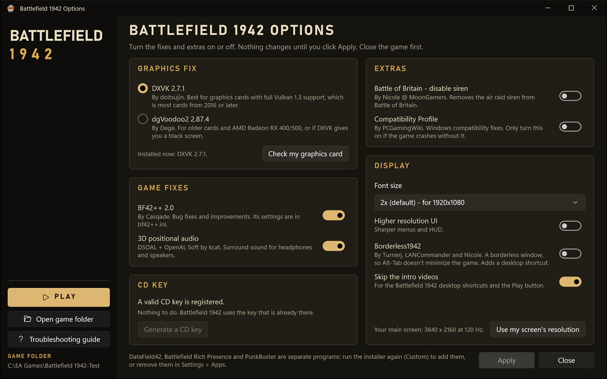

# BF1942-Installer-Options

**Battlefield 1942 Options**: the app that [BF1942-Installer](https://github.com/AnomalousNicole/BF1942-Installer) installs next to the game, so players can turn the fixes and extras on or off after install, without the setup file.

This repository is the app's source. BF1942-Installer includes it as a git submodule at `installer\BF1942Options`, and its `build.ps1` builds the app into every installer. To build an installer, start from **[BF1942-Installer](https://github.com/AnomalousNicole/BF1942-Installer)**.



---

## What it does

One window, in a Battlefield 1942 theme, with every option on one page:

| Option | What it changes |
|---|---|
| Graphics fix | DXVK or dgVoodoo2. **Check my graphics card** runs the same Vulkan check as Setup and picks the right one. Switching swaps the DLLs; `dxvk.conf` and `dgVoodoo.conf` stay in the folder with the player's settings (each fix reads only its own) |
| BF42++ and 3D positional audio | Each on or off on its own. With BF42++ on, DSOAL sits behind BF42++'s `dsound.dll` as `dsound_next.dll`; without it, DSOAL is `dsound.dll` |
| Font size | One of the `Font.rfa` files the installer ships |
| Higher resolution UI, Battle of Britain siren | The modified or the original `menu.rfa` / `Battle_of_Britain.rfa` |
| Borderless1942 | Its exe, a desktop shortcut and windowed mode in `VideoDefault.con` |
| Compatibility Profile | Registers or removes `BF1942.sdb` with `sdbinst` |
| Skip the intro videos | `+restart 1` on the desktop shortcuts |
| Resolution | **Use my screen's resolution** sets every `Video*.con` to the main screen |
| CD key | **Generate a CD key**, only when no valid key is registered |

The left side has **Play**, **Join** (when the installer has a server shortcut), **Join our Discord** (when it has a Discord invite), **Open game folder** and the **Troubleshooting guide**. With Borderless1942 on, **Play** and **Join** start the game through it, like its desktop shortcut. The app runs as administrator, but it starts the game, folders and links as the signed-in user.

## How it works

- **The library.** Setup keeps a copy of every fix the app can switch, plus the game's original files that the extras replace, in `{app}\Options`, and installs the app in `{app}\Options\App`. The app finds the game folder two levels above itself.
- **What is on** is read from the game folder every time: a file counts as on when it is identical (SHA-256) to its copy in the library. Extras that the installer was built without have no copy, and show as *Not included in this installer* (Borderless1942 on 32-bit Windows as *Only available on 64-bit Windows*); a font size without a copy is greyed out in the list.
- **`options.json`** next to the exe tells the app what the installer was built with. BF1942-Installer's `build.ps1` writes it from `config.json`:

  | Key | Meaning |
  |---|---|
  | `stateKey` | The registry key Setup keeps its state in (`registryStateKey`), under `HKLM\SOFTWARE\WOW6432Node` on 64-bit Windows (`HKLM\SOFTWARE` on 32-bit) |
  | `generateSerial` | Whether the CD key card is shown (`generateSerial`) |
  | `serverShortcut`, `serverAddress` | The server shortcut's name and `ip:port`, for **Join** (`serverShortcutName`, `serverAddress`) |
  | `discordUrl` | An invite for **Join our Discord** (`discordUrl`) |
  | `separatePrograms` | The separate programs the installer can add (DataField42, Battlefield Rich Presence, PunkBuster: the ones the build includes), named in the note at the bottom. An empty list hides the note |

- **`cover.bmp`** next to the exe, when there is one, is shown at the top of the left side. `build.ps1` copies your largest `branding\WizardImage*.bmp`; without it the side shows the game's name.
- **Administrator rights.** The manifest asks for them, because the app writes to the game folder and `HKLM`, and runs `sdbinst`. Every change is logged to `{app}\Options\Options.log`.

## Building

`build.ps1` in BF1942-Installer does this for you. By hand:

```powershell
dotnet publish BF1942Options.csproj -c Release -o publish -p:GameIcon="C:\path\to\Battlefield 1942\bf1942.ico"
```

- Needs the [.NET 10 SDK](https://dotnet.microsoft.com/download/dotnet/10.0) (`winget install --id Microsoft.DotNet.SDK.10 --exact`).
- WinUI 3 (Windows App SDK), 32-bit, self-contained and trimmed: players need no .NET or Windows App SDK, and it runs on Windows 10 version 1809 or later and Windows 11. The folder is about 70 MB.
- `GameIcon` is optional; it sets the exe and window icon to the game's.

## License

MIT - see [LICENSE](LICENSE). The published app includes the .NET runtime and the Windows App SDK (both MIT, by Microsoft).
